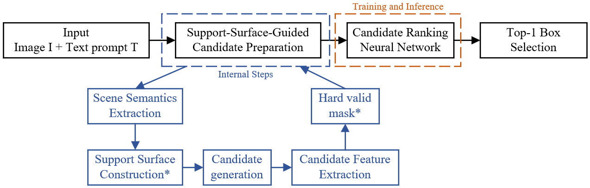

# Object Placement Localization in Street Scenes  

***Object Placement Localization in Street Scenes*** is a project that predicts where a new object, such as a person or a car, can be plausibly placed in a street-scene image given a text prompt. Instead of directly regressing one bounding box, our method first prepares a set of semantically reasonable candidate boxes, then uses a ranking neural network to score them, and finally selects the best placement. The overall pipeline includes support-surface-guided candidate preparation, candidate ranking, and top-1 box selection.  


## Installation  
- **Environment:**  
    - Python version 3.10 or higher is required.
    - Install the dependencies:  
    `pip install -r requirements.txt`
- **Dataset:**  
    - we preprocess the [Cityscapes dataset](https://www.cityscapes-dataset.com/) to construct a **BOOTPLACE-like dataset ([Download](https://ualberta-my.sharepoint.com/personal/zchai3_ualberta_ca/_layouts/15/onedrive.aspx?id=%2Fpersonal%2Fzchai3%5Fualberta%5Fca%2FDocuments%2FECE740%2Dgroup3%2Ddataset&ga=1))** for training and evaluating this framework.
    - Please place the downloaded dataset folder under the project root directory as `./bootplace_like_data/`
- **Pretrained Models**:
    We also provide pretrained checkpoints for the three model variants trained for 10 epochs. ([Download](https://drive.google.com/drive/folders/1GB2fwAEg-c6SwHDK4PckqtxZi9jKxCd9?usp=sharing)):  

    |Model|Description|
    |-----|----------|
    |candidate|Baseline candidate ranking model without semantic constraints|
    |supportsurface|Support-surface-guided candidate generation|
    |ss_hard|Support-surface-guided candidate generation with hard constraints|

## How to use  
```
project_root/
├── placement_localization_pipeline.ipynb
├── requirements.txt
├── code/
├── checkpoints/
└── bootplace_like_data/  
```
After completing the installation, please place the dataset and other necessary files under the project root directory.
- For a guided walkthrough, please refer to `placement_localization_pipeline.ipynb`, which contains clear explanations and notes for each part of the pipeline.
- If you prefer standalone Python scripts, please check the `code/` folder.

## Reference

This project is inspired by [BOOTPLACE (Hang Zhou)](https://github.com/RyanHangZhou/BOOTPLACE), but our setting is text-guided placement localization rather than full object composition. And we introduce support surface as the constraint to provide prior semantical information.
